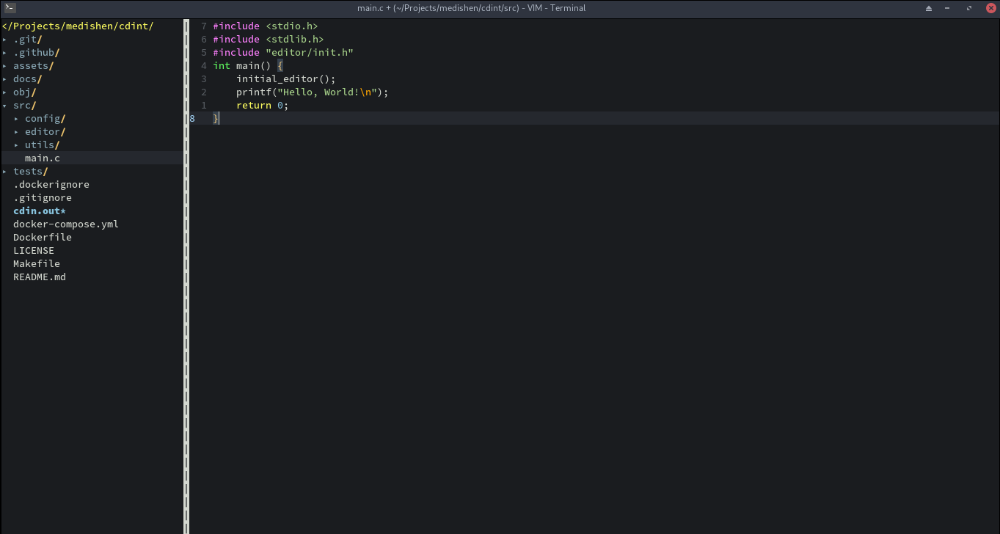

# Vim Config



A personal configuration for Vim, optimized for a modern coding experience with a dark, minimalist theme. This setup includes useful plugins, settings for code editing, and custom keybindings to improve productivity and streamline your workflow.

## Installation

### Prerequisites

- Vim 8 or higher with support for [plugins](https://vimhelp.org/).
- [Vim-plug](https://github.com/junegunn/vim-plug) for managing plugins.

### Steps

1. **Clone this repository** to your Vim configuration directory.

   ```bash
   git clone https://github.com/m-mdy-m/vim-config.git ~/.vim
   ```

2. **Install plugins** using Vim-plug.

   Open Vim and run the following command:

   ```vim
   :PlugInstall
   ```

   This will install all the plugins specified in `vim-config`.

3. **Install Prettier globally** (if not already installed):

   ```bash
   npm install -g prettier
   ```

4. **Customize your `.vimrc`** by linking or copying the `vimrc` settings from the repository.

   Example:

   ```bash
   ln -s ~/.vim/vimrc ~/.vimrc
   ```

   Or copy the `.vimrc` manually into your home directory.

## License

This project is licensed under the MIT License - see the [LICENSE](LICENSE) file for details.
